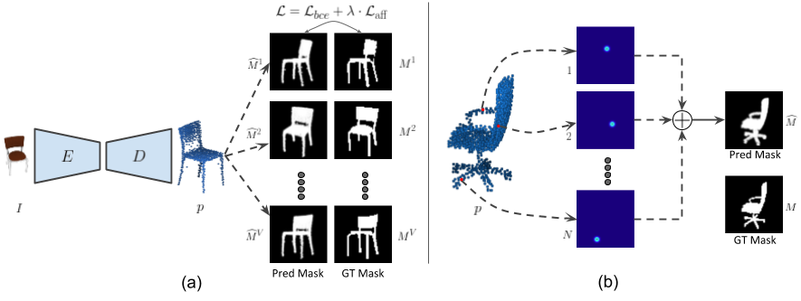

# CAPNet
Source codes for the paper [CAPNet: Continuous Approximation Projection For 3D Point Cloud Reconstruction Using 2D Supervision](https://arxiv.org/abs/1811.11731).</br>
Accepted at *Thirty-Third AAAI Conference on Artificial Intelligence (AAAI-19)*

## Overview
CAPNet proposes a 2D supervised approach for single image based 3D point cloud reconstruction. To obtain smooth projections from the reconstructed point and to enable end-to-end training of the network, we propose a novel differentiable rendering module termed CAPNet. Additionally, for effective backpropogation of gradients and to avoid outliers in our predictions, we introduce a loss term called affinity loss. We experimentally demostrate that through the use of just 2D mask supervision from multiple view points, it is possible to obtain reconstruction performance close to that of 3D supervised approaches. <br>



## Dataset
We use the ShapeNet dataset in our experiments. Ground truth point clouds and training and validation splits are provided below: <br>
ShapeNet pointclouds (~2.8 GB): https://drive.google.com/open?id=1cfoe521iTgcB_7-g_98GYAqO553W8Y0g <br>
ShapeNet train/val split: https://drive.google.com/open?id=10FR-2Lbn55POB1y47MJ12euvobi6mgtc <br>
We use the <a href="https://github.com/shubhtuls/drc/blob/master/docs/snet.md#rendering" target="_blank" >code</a> provided by Tulsiani et al. to obtain the rendered images.  

Download each of the folders, extract them and move them into *data/*. Save the rendered images in *data/ShapeNet_rendered/* <br> 
The folder structure should be as follows:<br>
--data/<br>
&nbsp;&nbsp;--ShapeNet_rendered/<br>
&nbsp;&nbsp;--ShapeNet_pcl/<br>
&nbsp;&nbsp;--splits/<br>

## Usage

Install [TensorFlow](https://www.tensorflow.org/install/). We recommend installing version 1.3 so that the additional TensorFlow ops can be compiled. <br>
Clone the repository:
```shell
git clone https://github.com/val-iisc/capnet.git
cd capnet
```
### Training
To train the model, run
```shell
bash run_train.sh
```
### Evaluation
For visualization and metric calculation, run
```shell
bash run_metrics.sh
```
Make sure that the trained model exists before running the metric calculation code. Use the option *--visualize* in place of *--tqdm* to visualize the reconstructed 3D point clouds.

## TODO
1. Provide pre-trained models
2. Add code for test-stage optimization
3. Add dataset and codes for training and evaluation on Pix3D dataset

## Citation
If you make use of the code, please cite the following work:
```
@inproceedings{kl2019capnet,
 author = {Navaneet, K L and Mandikal, Priyanka and Agarwal, Mayank and Babu, R Venkatesh},
 booktitle = {Thirty-Third AAAI Conference on Artificial Intelligence{(AAAI-19)}},
 title = {{CAPNet}: Continuous Approximation Projection For 3D Point Cloud Reconstruction Using 2D Supervision},
 year = {2019}
}
```
